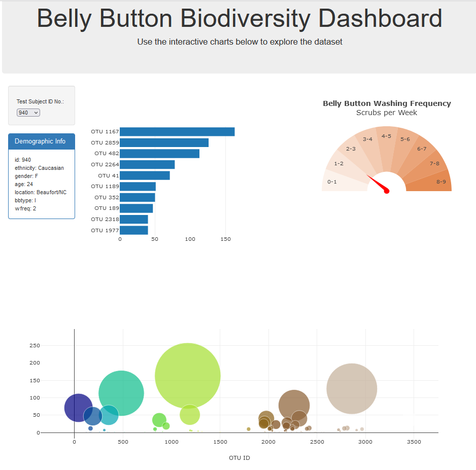
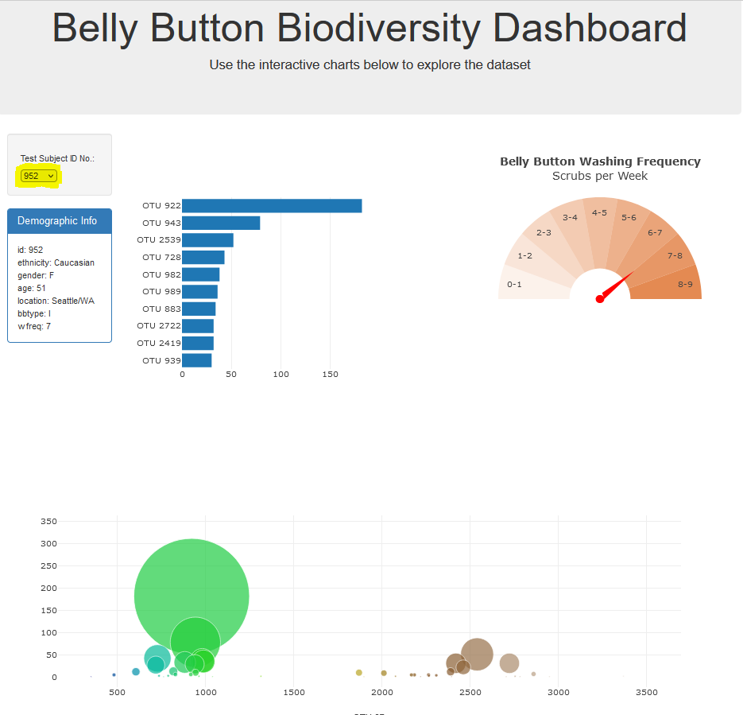

# Belly Button Biodiversity

This dashboard explores the [Belly Button Biodiversity dataset](http://robdunnlab.com/projects/belly-button-biodiversity/), which cataloges the microbes that colonise human navels.

 

 

## Tools/Packages used
- HTML
- CSS
- Javascript
    - Bootstrap
    - Plotly.js
    - D3.js

 

## How to run
- Clone the respository
- Open Git Bash in the directory and type `python -m http.server` to launch the python server, then go to your local host, e.g `localhost:8000`.
